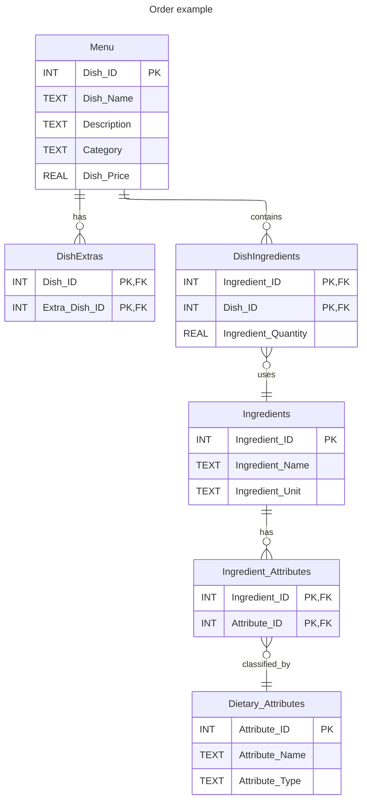

Data base diagram:

```mermaid
---
title: Order example
config:
    layout: elk
---
erDiagram
    Menu {
        INT Dish_ID PK
        TEXT Dish_Name
        TEXT Description
        TEXT Category
        REAL Dish_Price
    }
    
    DishExtras {
        INT Dish_ID PK,FK
        INT Extra_Dish_ID PK,FK
    }
    
    DishIngredients {
        INT Ingredient_ID PK,FK
        INT Dish_ID PK,FK
        REAL Ingredient_Quantity
    }
    
    Ingredients {
        INT Ingredient_ID PK
        TEXT Ingredient_Name
        TEXT Ingredient_Unit
    }
    
    Dietary_Attributes {
        INT Attribute_ID PK
        TEXT Attribute_Name
        TEXT Attribute_Type
    }
    
    Ingredient_Attributes {
        INT Ingredient_ID PK,FK
        INT Attribute_ID PK,FK
    }
    
    Menu ||--o{ DishExtras : "has"
    Menu ||--o{ DishIngredients : "contains"
    DishIngredients }o--|| Ingredients : "uses"
    Ingredients ||--o{ Ingredient_Attributes : "has"
    Ingredient_Attributes }o--|| Dietary_Attributes : "classified_by"
```